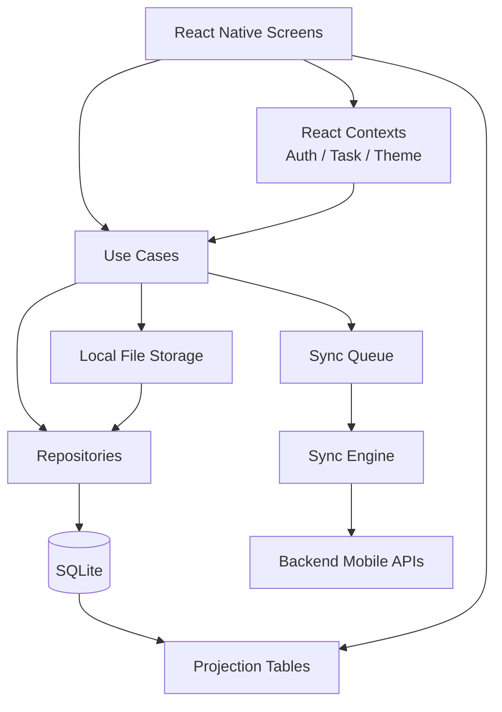

# Mobile Architecture

## Scope

This document describes the architecture of the `crm-mobile-native` application in the repository root. It is intended as a reference for future code changes.

The mobile app is an offline-first React Native field-verification client. SQLite is the operational source of truth for task execution. Network APIs are integrated through a queue-driven sync pipeline, so the app can continue to function when connectivity is weak or absent.

## High-Level Architecture



## Startup Flow

Entry point: `crm-mobile-native/App.tsx`

App startup initializes the system in this order:

1. Initialize SQLite through `DatabaseService.initialize()`.
2. Recover expired sync queue leases.
3. Rebuild projection tables.
4. Start network monitoring.
5. Load notifications from SQLite and attach push listeners.
6. Start the background sync daemon.
7. Start mobile telemetry.
8. Initialize the camera service in the background.
9. Request startup permissions on Android.

Provider tree:

- `SafeAreaProvider`
- `ThemeProvider`
- `AuthProvider`
- `TaskProvider`
- `ErrorBoundary`
- `RootNavigator`

## Folder Structure

```text
crm-mobile-native/
  App.tsx
  index.js
  package.json
  app.json
  android/
  ios/
  __tests__/
  patches/
  vendor/
  src/
    api/
      apiClient.ts
      endpoints.ts
    assets/
      images/
    components/
      media/
      profile/
      tasks/
      ui/
    config/
      index.ts
    context/
      AuthContext.tsx
      TaskContext.tsx
      ThemeContext.tsx
    database/
      DatabaseService.ts
      schema.ts
    hooks/
      useTask.ts
      useTasks.ts
      forms/
        useFormAutosave.ts
    navigation/
      RootNavigator.tsx
    projections/
      ProjectionUpdater.ts
      TaskListProjection.ts
      TaskDetailProjection.ts
      DashboardProjection.ts
    repositories/
      TaskRepository.ts
      AttachmentRepository.ts
      LocationRepository.ts
      FormRepository.ts
      SyncQueueRepository.ts
      SyncMetadataRepository.ts
      UserSessionRepository.ts
      KeyValueRepository.ts
      NotificationRepository.ts
      MaintenanceRepository.ts
    screens/
      auth/
      forms/
      main/
      tasks/
    services/
      AuthService.ts
      SessionStore.ts
      NetworkService.ts
      CameraService.ts
      LocationService.ts
      NotificationService.ts
      AttachmentService.ts
      StorageService.ts
      SyncQueue.ts
      SyncGateway.ts
      SyncService.ts
      VersionService.ts
      PushTokenService.ts
      forms/
    sync/
      SyncEngine.ts
      SyncProcessor.ts
      SyncUploadService.ts
      SyncDownloadService.ts
      SyncScheduler.ts
      SyncStateService.ts
      SyncHealthService.ts
      SyncWatchdogService.ts
      SyncConflictResolver.ts
      SyncOperationLog.ts
      SyncOperationStateService.ts
      SyncRetryPolicy.ts
      BackgroundSyncDaemon.ts
      uploaders/
    telemetry/
      MobileTelemetryService.ts
    theme/
      Theme.ts
    types/
    usecases/
    utils/
```

## Navigation Architecture

Primary file: `src/navigation/RootNavigator.tsx`

Navigation uses:

- `NavigationContainer`
- Root `NativeStackNavigator`
- Nested `BottomTabNavigator`

Navigation states:

1. Loading gate
   - waits for auth initialization and version check
2. Forced update gate
   - `ForceUpdateScreen`
3. Unauthenticated
   - `LoginScreen`
4. Authenticated
   - `Main` tab navigator plus detail screens

Bottom tabs:

- `Dashboard`
- `Assigned`
- `InProgress`
- `Saved`
- `Completed`

Stack screens above tabs:

- `TaskDetail`
- `TaskAttachments`
- `CameraCapture`
- `WatermarkPreview`
- `VerificationForm`
- `SyncLogs`
- `Profile`
- `DigitalIdCard`

Important characteristics:

- No drawer navigation
- No Redux-connected navigation state
- No nested stack per tab
- Camera and watermark screens are presented as full-screen modal-style stack screens

## State Management

The app uses React Context plus local SQLite state rather than a centralized in-memory store.

### Contexts

- `AuthContext`
  - owns auth state
  - restores session on startup
  - starts and stops periodic sync based on auth state
  - triggers immediate sync on assignment notifications
- `TaskContext`
  - owns the current in-memory task list snapshot
  - exposes task mutation methods
  - wraps use cases, repositories, and sync triggers
- `ThemeContext`
  - owns light/dark/system preference

### Actual Source of Truth

Persistent state lives in SQLite:

- tasks
- attachments
- locations
- form submissions
- sync queue
- notifications
- user session
- key-value storage

The in-memory state held in contexts is a convenience layer for rendering and coordination, not the durable truth.

### Hook Layer

- `useTasks`
  - reads from `task_list_projection`
  - returns task actions from `TaskContext`
- `useTask`
  - resolves one task plus its locations
  - refreshes when the screen gains focus
- `useFormAutosave`
  - persists drafts into both task form JSON and key-value storage

## API Service Layer

### Core API Client

Primary files:

- `src/api/apiClient.ts`
- `src/api/endpoints.ts`

`ApiClient` is a singleton Axios instance that:

- injects bearer tokens from `SessionStore`
- adds platform and app-version headers
- handles `401` refresh and request replay
- exposes `get`, `post`, `put`, `delete`, and multipart upload methods

### Service Layer Above API Client

- `AuthService`
  - login, refresh, logout, device info
- `AttachmentService`
  - loads backend attachments for viewing
- `FormTemplateService`
  - loads templates from local cache or backend
- `VersionService`
  - checks force-update state
- sync uploaders
  - call task, location, attachment, and form endpoints during queued sync

### Endpoint Domains

- auth
- task lifecycle
- attachments
- typed verification forms
- location capture
- sync upload/download
- notifications
- version/config
- telemetry

## SQLite Database Architecture

Primary files:

- `src/database/DatabaseService.ts`
- `src/database/schema.ts`

Database characteristics:

- SQLite via `react-native-sqlite-storage`
- WAL mode enabled
- foreign keys enabled
- schema versioned through `PRAGMA user_version`
- migrations defined in `schema.ts`

### Core Tables

#### `tasks`

Stores local task assignments and lifecycle state:

- identifiers
- customer and address data
- verification metadata
- task status
- revoke/saved/in-progress/completed timestamps
- form JSON
- sync status

#### `attachments`

Stores locally captured evidence metadata:

- file paths
- thumbnail paths
- mime type
- size
- geo metadata
- component type such as `photo` or `selfie`
- backend attachment ID after sync

#### `locations`

Stores visit and travel GPS points:

- lat/lng/accuracy
- timestamp
- source
- task linkage
- activity type
- sync status

#### `form_submissions`

Stores locally persisted form submissions:

- task and case linkage
- form type
- form JSON
- metadata JSON
- attachment IDs JSON
- photo metadata JSON
- sync status

#### `sync_queue`

Stores pending upload operations:

- action type
- entity type
- entity ID
- payload JSON
- status
- priority
- attempt count
- retry timing
- processing lease timestamps

#### `sync_metadata`

Stores sync-cycle metadata:

- last download sync timestamp
- last upload sync timestamp
- sync-in-progress flag
- device ID

#### Other Tables

- `form_templates`
- `user_session`
- `audit_log`
- `notifications`
- `key_value_store`

### Projection Tables

Projection tables are important because most UI reads do not query raw task tables directly.

- `task_list_projection`
  - powers list screens and search
- `task_detail_projection`
  - powers single-task reads
- `dashboard_projection`
  - powers dashboard counters and last-sync label

`ProjectionUpdater` rebuilds these after mutations and after sync downloads.

## Repository Layer

Repositories are the SQL boundary for the app.

Key repositories:

- `TaskRepository`
- `AttachmentRepository`
- `LocationRepository`
- `FormRepository`
- `SyncQueueRepository`
- `SyncMetadataRepository`
- `UserSessionRepository`
- `KeyValueRepository`
- `NotificationRepository`

Repository responsibilities:

- isolate SQL from UI and use cases
- mark rows pending/synced
- update timestamps
- keep projections rebuilt after task changes

## Sync Architecture

Primary files:

- `src/services/SyncQueue.ts`
- `src/services/SyncGateway.ts`
- `src/sync/SyncEngine.ts`
- `src/sync/SyncProcessor.ts`
- `src/sync/SyncDownloadService.ts`
- `src/sync/uploaders/*`

### Design Model

All local mutations are written first. Network upload is deferred into `sync_queue`. The sync engine later processes that queue and reconciles local state with the backend.

### Queue Entry Types

Supported entity types:

- `TASK`
- `TASK_STATUS`
- `ATTACHMENT`
- `VISIT_PHOTO`
- `LOCATION`
- `FORM_SUBMISSION`

Priority constants:

- `CRITICAL = 1`
- `HIGH = 3`
- `NORMAL = 5`
- `LOW = 7`

### Queue Behavior

`SyncQueue`:

- inserts operations
- deduplicates pending `TASK_STATUS` rows per task
- assigns operation metadata
- recovers expired leases
- marks rows `IN_PROGRESS`, `COMPLETED`, `PENDING`, or `FAILED`

`SyncQueueRepository` adds:

- retry scheduling
- failed-item reset
- completed-item cleanup
- blocking-count helpers for forms

### Sync Engine Flow

`SyncEngine.performSync()`:

1. prevents concurrent sync cycles
2. checks backend reachability
3. marks sync in progress
4. recovers expired leases
5. starts watchdog heartbeat
6. processes pending upload items through `SyncProcessor`
7. if upload phase did not stall, downloads server-side changes
8. skips bulk template download because backend is per-template
9. cleans up completed queue rows
10. records health and telemetry

### Sync Processor

`SyncProcessor`:

- loads processible queue rows
- converts each row into a normalized sync operation
- skips already-processed operation IDs
- enforces a per-task lock
- dispatches to the correct uploader
- handles outcomes:
  - `SUCCESS`
  - `DEFER`
  - `FAILURE`

### Uploaders

- `TaskUploader`
  - start, complete, revoke, priority updates
- `LocationUploader`
  - location capture upload
  - treats duplicate-location `409` responses as success
- `AttachmentUploader`
  - multipart upload of photo files
  - fills backend attachment ID on success
- `FormUploader`
  - uploads typed verification form
  - defers until blocking photos and locations are already synced
  - marks task completed locally when server accepts the form

### Download Side

`SyncDownloadService`:

- reads `last_download_sync_at`
- pages through `/sync/download`
- upserts tasks into local SQLite
- merges with local state through conflict resolution
- rebuilds projections
- creates local assignment notifications for newly seen tasks
- removes revoked or deleted tasks

### Background Sync

`BackgroundSyncDaemon`:

- listens to app state
- runs periodic background ticks
- skips when offline or disallowed by native bridge / power policy
- can run headless sync

## Local Persistence Model

### Tasks

Local tasks are stored in `tasks`.

Important fields:

- `id`
- `verification_task_id`
- `status`
- `priority`
- `form_data_json`
- `is_saved`
- `is_revoked`
- `sync_status`

List screens primarily read from projections, not raw tasks.

### Photos and Selfies

Capture path:

1. `CameraCaptureScreen` captures image
2. `WatermarkPreviewScreen` overlays evidence watermark
3. `CameraService.savePhoto()` moves file into app storage
4. `AttachmentRepository.create()` writes DB row
5. `SyncGateway.enqueueAttachment()` writes queue row

Files are stored under:

- `DocumentDirectoryPath/photos`
- `DocumentDirectoryPath/photos/thumbnails`

SQLite metadata is stored in `attachments`.

### Locations

`LocationService.recordLocation()`:

1. requests GPS
2. inserts into `locations`
3. enqueues a sync operation

Tracked travel positions are written as `TRAVEL` activity rows and synced with lower priority.

### Form Submissions

`SubmitVerificationUseCase`:

1. validates minimum evidence count
2. validates photo geotag presence
3. validates latest task location exists
4. creates `form_submissions` row
5. updates task `form_data_json`
6. updates local verification outcome
7. patches pending attachment queue payloads with submission metadata
8. enqueues form submission
9. attempts immediate sync if online

## Screen Interaction Patterns

### Dashboard

`DashboardScreen` reads:

- dashboard counters from `TaskRepository` and `DashboardProjection`
- recent activity from projections
- notifications from `NotificationService`

It can also trigger manual sync through `SyncTasksUseCase`.

### Task Lists

`TaskListScreen`:

- reads through `useTasks`
- uses `task_list_projection`
- refreshes on focus
- supports search and task reordering
- persists task priority back into SQLite and sync queue

### Task Detail

`TaskDetailScreen`:

- reads task and locations through `useTask`
- starts visits through `StartVisitUseCase`
- routes in-progress work to the verification form

### Verification Form

`VerificationFormScreen`:

- loads the task locally
- resolves the form type from task metadata
- loads a template from:
  - legacy builder
  - local template cache
  - backend template API
- auto-saves form values
- renders local photo galleries
- submits through `FormSubmissionService` and `SubmitVerificationUseCase`

### Photo Gallery

`PhotoGallery`:

- reads local evidence rows from `attachments`
- renders images directly from local file paths
- allows deletion of unsynced local photos

### Task Attachments

`TaskAttachmentsScreen` is separate from local evidence capture:

- it reads backend attachments through `AttachmentService`
- downloads and caches files for preview
- it is not the same storage path as field-captured local evidence

## Authentication and Session Model

Primary files:

- `src/context/AuthContext.tsx`
- `src/services/AuthService.ts`
- `src/services/SessionStore.ts`

Auth model:

- access and refresh tokens are stored in Keychain
- user profile is stored in SQLite `user_session`
- token expiry and misc session flags are stored in `key_value_store`
- app restores auth on launch
- successful auth starts periodic sync and triggers an immediate sync attempt

## Auto-Save Model

Form drafts are persisted in two places:

- `tasks.form_data_json`
- `key_value_store` using key format `auto_save_<taskId>`

This allows:

- draft recovery after navigation
- draft recovery after app restart
- local-first form continuity even before submission

## Important Runtime Rules

- SQLite is the durable state layer.
- Screens should prefer repositories or projections over ad hoc SQL.
- Mutations should be local-first, then sync-queued.
- Forms are uploaded only after required evidence is synced.
- Projection rebuilds are part of correctness, not just optimization.
- Queue lease recovery matters for crash safety.

## Key Files To Read Before Making Changes

### App bootstrap

- `crm-mobile-native/App.tsx`

### Navigation

- `crm-mobile-native/src/navigation/RootNavigator.tsx`

### Contexts

- `crm-mobile-native/src/context/AuthContext.tsx`
- `crm-mobile-native/src/context/TaskContext.tsx`

### Database and projections

- `crm-mobile-native/src/database/DatabaseService.ts`
- `crm-mobile-native/src/database/schema.ts`
- `crm-mobile-native/src/projections/ProjectionUpdater.ts`

### Task and evidence persistence

- `crm-mobile-native/src/repositories/TaskRepository.ts`
- `crm-mobile-native/src/repositories/AttachmentRepository.ts`
- `crm-mobile-native/src/repositories/LocationRepository.ts`
- `crm-mobile-native/src/repositories/FormRepository.ts`

### Sync pipeline

- `crm-mobile-native/src/services/SyncQueue.ts`
- `crm-mobile-native/src/services/SyncGateway.ts`
- `crm-mobile-native/src/sync/SyncEngine.ts`
- `crm-mobile-native/src/sync/SyncProcessor.ts`
- `crm-mobile-native/src/sync/SyncDownloadService.ts`
- `crm-mobile-native/src/sync/uploaders/TaskUploader.ts`
- `crm-mobile-native/src/sync/uploaders/AttachmentUploader.ts`
- `crm-mobile-native/src/sync/uploaders/LocationUploader.ts`
- `crm-mobile-native/src/sync/uploaders/FormUploader.ts`

### UI flows

- `crm-mobile-native/src/screens/tasks/TaskListScreen.tsx`
- `crm-mobile-native/src/screens/tasks/TaskDetailScreen.tsx`
- `crm-mobile-native/src/screens/forms/VerificationFormScreen.tsx`
- `crm-mobile-native/src/components/media/CameraCaptureScreen.tsx`
- `crm-mobile-native/src/components/media/WatermarkPreviewScreen.tsx`
- `crm-mobile-native/src/components/media/PhotoGallery.tsx`

## Current Architectural Summary

The mobile app is not a thin API client. It is a locally persistent workflow engine for field execution. The backend is integrated through a resilient queue-based sync model, but the immediate user experience is driven by SQLite, projections, and local file storage. That design choice is the most important thing to preserve when making future changes.
