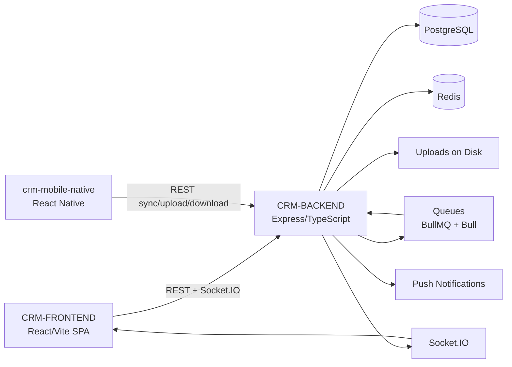
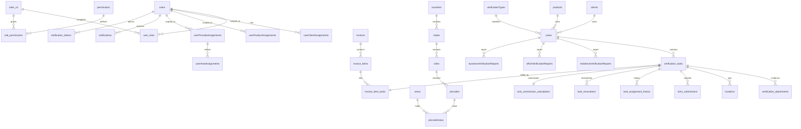
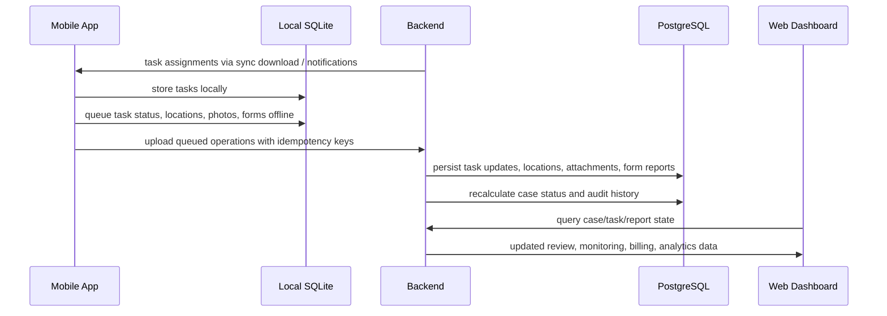
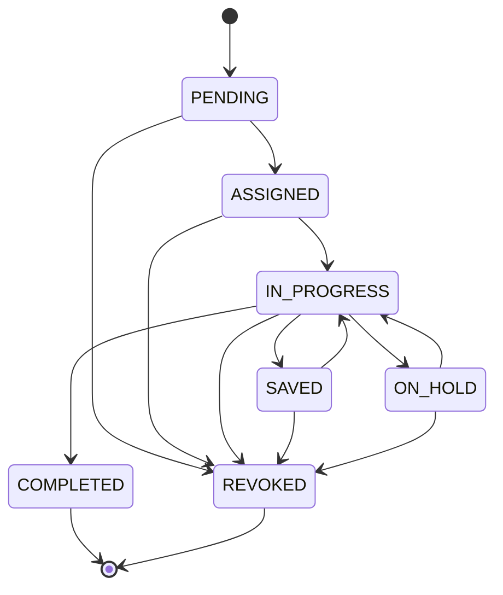

# System Map

Snapshot date: 2026-03-16

This document is a working architecture reference for the monorepo rooted at `CRM-APP-MONOREPO-PROD`.
It is based on direct inspection of the current backend, frontend, mobile, database dump, and migrations.

## Scope

Included:

- `CRM-BACKEND`
- `CRM-FRONTEND`
- `crm-mobile-native`
- `db`
- shared behavior across these apps through API contracts and database schema

Not found:

- no separate `shared/`, `common/`, `packages/`, or `libs/` package
- no dedicated outbound bank/client API integration module beyond report/export style outputs

## Monorepo Overview

```text
CRM-APP-MONOREPO-PROD/
├── CRM-BACKEND/           Express + TypeScript API
├── CRM-FRONTEND/          React + Vite web dashboard
├── crm-mobile-native/     React Native offline-first field app
├── db/                    production SQL dump + schema notes
├── docs/                  migration and API notes
└── package.json           lightweight root launcher only
```

## High-Level Architecture



## Key Entry Points

### Backend

- `CRM-BACKEND/src/index.ts`: process startup, DB connect, Redis connect, cache warmup, queue init, Socket.IO boot, graceful shutdown
- `CRM-BACKEND/src/app.ts`: Express app, middleware, route mounts
- `CRM-BACKEND/src/config/db.ts`: PostgreSQL pool and transaction helpers
- `CRM-BACKEND/src/config/redis.ts`: Redis client setup
- `CRM-BACKEND/src/config/queue.ts`: BullMQ queues
- `CRM-BACKEND/src/websocket/server.ts`: Socket.IO auth, rooms, notification emitters

### Web

- `CRM-FRONTEND/src/App.tsx`: providers and app boot
- `CRM-FRONTEND/src/components/AppRoutes.tsx`: route map and permission gating
- `CRM-FRONTEND/src/contexts/AuthContext.tsx`: auth lifecycle and permission refresh
- `CRM-FRONTEND/src/services/api.ts`: Axios client, token refresh, request metrics/cache

### Mobile

- `crm-mobile-native/src/navigation/RootNavigator.tsx`: app navigation
- `crm-mobile-native/src/context/AuthContext.tsx`: login restore, notification registration, periodic sync startup
- `crm-mobile-native/src/database/schema.ts`: SQLite schema and migrations
- `crm-mobile-native/src/sync/SyncEngine.ts`: sync orchestrator

### Database

- `db/backups/acs_db_2026-02-25_final_full.sql`: current baseline production schema dump
- `CRM-BACKEND/migrations/*.sql`: additive changes after the baseline dump

## Backend Architecture

### Runtime Shape

- Express 5 API with TypeScript
- PostgreSQL is the source of truth
- Redis is used for cache, rate limits, telemetry counters, and queue backing
- Queue stack is mixed:
  - BullMQ for `background-sync`, `notifications`, `file-processing`, `geolocation`, `case-assignment`
  - Bull for `notification-processing`
- Socket.IO provides real-time notifications and permission refresh events

### Core Middleware

- `auth.ts`: JWT auth plus live permission/scope loading from database
- `authorize.ts`: permission-code checks with strict task ownership for field execution
- `rateLimiter.ts`: express-rate-limit middleware families
- `enterpriseRateLimit.ts`: Redis-backed rate limiter
- `enterpriseCache.ts`: response caching and invalidation wrappers
- `idempotency.ts`: mobile write dedup using `mobile_idempotency_keys`
- `mobileValidation.ts`: mobile version enforcement and mobile-specific rate limiting
- `errorHandler.ts`: standard JSON error handling

### Route Domains

The backend exposes 43 route files and 412 route declarations. The major route groups are:

- Auth: `/api/auth/*`
- Cases: `/api/cases/*`
- Verification tasks: `/api/verification-tasks/*`
- Attachments: `/api/attachments/*`
- Users and RBAC: `/api/user/*`, `/api/users/*`, `/api/roles/*`, `/api/rbac/*`, `/api/permissions/*`
- Master data:
  - `/api/clients`
  - `/api/products`
  - `/api/verification-types`
  - `/api/document-types`
  - `/api/document-type-rates`
  - `/api/rate-types`
  - `/api/rates`
  - `/api/countries`
  - `/api/states`
  - `/api/cities`
  - `/api/pincodes`
  - `/api/areas`
  - `/api/territory-assignments`
- Reporting and analytics:
  - `/api/dashboard`
  - `/api/reports`
  - `/api/enhanced-analytics`
  - `/api/exports`
  - `/api/template-reports`
  - `/api/ai-reports`
- Billing:
  - `/api/invoices`
  - `/api/commissions`
  - `/api/commission-management`
- Monitoring and audit:
  - `/api/audit-logs`
  - `/api/notifications`
  - `/api/security`
  - `/api/field-monitoring`
- Mobile API: `/api/mobile/*`

### Core Business Aggregate

- `cases` is the business container
- `verification_tasks` is the operational work item
- field execution is task-centric, not case-centric
- task assignment, evidence capture, location capture, form submission, revocation, and completion all operate at task level

## Database

### Source of Truth

The schema is not modeled through Prisma or a code-first ORM. The effective source of truth is:

1. `db/backups/acs_db_2026-02-25_final_full.sql`
2. additive SQL under `CRM-BACKEND/migrations`

The dump contains:

- 97 tables
- 16 views
- 47 SQL functions
- 51 triggers

### Core Tables

#### Identity, auth, RBAC

- `users`
- `roles`
- `roles_v2`
- `permissions`
- `role_permissions`
- `user_roles`
- `refreshTokens`
- `trusted_devices`

#### Operational scope

- `userClientAssignments`
- `userProductAssignments`
- `userPincodeAssignments`
- `userAreaAssignments`
- `territoryAssignmentAudit`

#### Case and task domain

- `cases`
- `verification_tasks`
- `task_assignment_history`
- `case_assignment_history`
- `case_assignment_queue_status`
- `task_revocations`
- `caseDeduplicationAudit`
- `case_timeline_events`

#### Evidence and field execution

- `verification_attachments`
- `attachments`
- `locations`
- `form_submissions`
- `task_form_submissions`
- report tables:
  - `residenceVerificationReports`
  - `officeVerificationReports`
  - `businessVerificationReports`
  - `builderVerificationReports`
  - `residenceCumOfficeVerificationReports`
  - `dsaConnectorVerificationReports`
  - `propertyIndividualVerificationReports`
  - `propertyApfVerificationReports`
  - `nocVerificationReports`

#### Master data

- `clients`
- `products`
- `verificationTypes`
- `documentTypes`
- `documentTypeRates`
- `rateTypes`
- `rates`
- `rateTypeAssignments`
- `countries`
- `states`
- `cities`
- `pincodes`
- `areas`
- `pincodeAreas`

#### Notifications and monitoring

- `notifications`
- `notification_tokens`
- `notification_preferences`
- `notification_delivery_log`
- `mobile_notification_queue`
- `mobile_notification_audit`
- `mobile_device_sync`
- `performance_metrics`
- `query_performance`
- `system_health_metrics`
- `security_audit_events`

#### Billing and commissions

- `task_commission_calculations`
- `commission_calculations`
- `commission_payment_batches`
- `commission_batch_items`
- `field_user_commission_assignments`
- `invoices`
- `invoice_items`
- `invoice_item_tasks`
- `invoice_status_history`

#### Mobile reliability

- `mobile_idempotency_keys`
- `mobile_operation_log`

### ER Diagram



### Stored Logic

Important SQL functions and triggers:

- `generate_task_number()`: task number generation
- `update_case_completion_percentage()`: rolls case completion from task status changes
- many `update_*_updated_at()` functions: timestamp maintenance
- `create_default_notification_preferences()`: new user notification defaults
- `audit_territory_assignment_changes()`: assignment audit
- `create_rate_history()` and `log_rate_changes()`: rate change history

### Constraints and Indexing Themes

Important uniqueness rules:

- `users.username`
- `permissions.code`
- `roles_v2.name`
- `user_roles(user_id, role_id)`
- `role_permissions(role_id, permission_id)`
- `verification_tasks.task_number`
- `task_commission_calculations.verification_task_id`
- `task_form_submissions(verification_task_id, form_submission_id)`
- active territory uniqueness on user pincode and area assignments
- `mobile_device_sync(userId, deviceId)`
- `notification_tokens(device_id, platform)`
- mobile idempotency uniqueness on `(idempotency_key, user_id, scope)`
- `mobile_operation_log.operation_id`
- task-level invoice uniqueness on `invoice_item_tasks.verification_task_id`

Important index themes:

- case filtering/search by status, client, product, created/updated timestamps, customer name, phone, PAN
- task filtering by assignee, case, status, priority, saved/revoked flags
- form submission analytics by task, type, status, submitter, time
- verification attachment lookup by task, case, photo type, deletion state
- notification lookup by user, type, read state, created time
- mobile sync/idempotency indexes added in March 2026 for reliability

## Redis

### What Redis Is Used For

- response cache
- rate limiting
- telemetry counters
- Bull/BullMQ queue backing

### Key Families

From `EnterpriseCacheService` and mobile rate-limit logic:

- `user:${userId}`
- `users:stats:${userId}`
- `case:${caseId}`
- `case:${userId}:${caseId}`
- `case:${caseId}:attachments`
- `analytics:field-agent-workload`
- `analytics:case-stats`
- `session:${sessionId}`
- `rate_limit:${action}:${identifier}`
- `mobile:sync:${userId}`
- `mobile:sync:${userId}:${queryHash}`
- `field-monitoring:*`
- `notifications:${userId}`
- `mobile:telemetry:${metricName}:${YYYY-MM-DD}`
- `mobile:rate-limit:${ip}:${windowBucket}`

### What Redis Is Not Doing

- not the primary session store
- not the source of truth for auth
- not the primary websocket pub/sub bus

JWT session truth and refresh token storage live in PostgreSQL plus client-side token storage.

## Web Dashboard

### Stack

- React 19
- Vite
- React Router
- TanStack Query
- Tailwind
- Axios service layer
- Socket.IO client for real-time events

### Main Providers

- theme
- query client
- auth
- permission context
- layout context

### Route and Permission Model

Page access is permission-code based.

- `page.dashboard`
- `page.cases`
- `page.tasks`
- `page.masterdata`
- `page.reports`
- `page.analytics`
- `page.billing`
- `page.users`
- `page.field_monitoring`
- `page.rbac`
- `page.settings`

### Main Pages

- Dashboard
- Cases
- Case detail
- New case
- Dedupe
- Task lists:
  - pending
  - revoked
  - in-progress
  - completed
  - revisit
  - TAT monitoring
  - all tasks
- Clients
- Products
- Verification types
- Document types
- Rate management
- Locations
- Reports
- Analytics
- MIS dashboard
- Billing
- Invoices
- Commissions
- Commission management
- Users
- User permissions
- Field monitoring
- RBAC admin
- Security UX
- Settings

### Web State Model

Primary state approach:

- React Query for server state
- Auth and permission contexts for auth/session state
- local component state for page UX

There is also `src/store/enterpriseStore.ts` using Redux Toolkit, but it is not wired into the main app bootstrap and looks legacy or experimental.

### Real-Time Behavior

The web app subscribes to:

- `permissions_updated`
- `notification`

These events cause auth context refresh and query invalidation.

## Mobile App

### Stack

- React Native
- SQLite local database
- Axios API client
- secure token storage in Keychain
- Firebase messaging for push notifications
- geolocation and camera services

### Navigation

Authenticated tabs:

- Dashboard
- Assigned
- InProgress
- Saved
- Completed

Additional stack screens:

- TaskDetail
- TaskAttachments
- CameraCapture
- WatermarkPreview
- VerificationForm
- SyncLogs
- Profile
- DigitalIdCard

### Mobile Local Database

Main SQLite tables:

- `tasks`
- `attachments`
- `locations`
- `form_submissions`
- `form_templates`
- `sync_queue`
- `sync_metadata`
- `user_session`
- `audit_log`
- `notifications`
- `key_value_store`

Read-optimized projections:

- `task_list_projection`
- `task_detail_projection`
- `dashboard_projection`

Note:

- `DB_VERSION` in schema is `8`
- app config still reports `dbVersion: 7`
- this mismatch should be treated as a maintenance risk

### Mobile Sync Architecture

Queue item entity types:

- `TASK`
- `TASK_STATUS`
- `ATTACHMENT`
- `VISIT_PHOTO`
- `LOCATION`
- `FORM_SUBMISSION`

Priority model:

- critical = 1
- high = 3
- normal = 5
- low = 7

Upload order:

1. task status and location changes
2. photo uploads
3. form submission after all pending location and photo work is flushed

Mobile writes are protected by:

- `Idempotency-Key`
- local retry counts
- queue leases
- operation IDs stored server-side

### Device Capabilities Used

- photo capture
- selfie capture
- local file storage
- thumbnail generation
- GPS capture
- background-ish periodic sync scheduling
- push notification registration and refresh

### Photo and Form Rules

Current mobile UX enforces:

- minimum 5 general photos
- minimum 1 selfie
- latest location required before submission

Backend also validates photo presence for completion/report logic, though some validation paths are older and less aligned than the mobile flow.

## Mobile API to Backend Data Flow



## Offline Sync Details

### Download

- mobile calls `/api/mobile/sync/download`
- backend returns task-centric snapshots, attachment deltas, revoked assignment IDs, sync timestamp, and pagination info
- mobile upserts server tasks into SQLite and rebuilds projections

### Upload

- mobile calls dedicated endpoints for task status, location, attachments, and form submission
- `/api/mobile/verification-tasks/:taskId/operations` supports operation-based task changes
- backend records operations in `mobile_operation_log`
- backend uses `mobile_idempotency_keys` to replay safe successful responses

### Conflict Handling

- mobile uses a local sync conflict resolver when merging downloaded tasks with local pending state
- backend download includes `revokedAssignmentIds`
- revoked tasks are deleted locally from active task storage

## Task Lifecycle State Machine



Notes:

- revisit is not a status; it is a new child task with `task_type = REVISIT` and `parent_task_id`
- case status is derived from child task statuses via `CaseStatusSyncService`

## Assignment and Task Flow

### Task Creation

- web creates case via `/api/cases/create`
- case may create one or many `verification_tasks`
- territory and financial validation run during task creation

### Assignment

- assignment is task-level, not case-level
- assignment requests enqueue BullMQ jobs
- worker updates task assignee and assignment history
- notifications are queued for new and previous assignees

### Field Execution

- field agent syncs assigned tasks
- start visit requires location validation
- evidence and location can be collected offline
- form submission is delayed until prerequisite evidence uploads succeed

### Completion and Review

- task completion and form submission update task and case state
- review permissions and UI exist
- review metadata exists in schema
- dedicated backend review endpoints are not fully implemented as a clean standalone surface yet

### Billing

- commission data is task-linked
- invoice items can point to individual verification tasks
- billing pages and APIs exist for invoice and commission workflows

## Notifications and Realtime

### Persistence

- `notifications`
- `notification_tokens`
- `notification_preferences`
- `notification_delivery_log`
- `mobile_notification_queue`
- `mobile_notification_audit`

### Delivery Paths

- web via Socket.IO
- mobile via push token registration and backend notification APIs
- backend queue processors also generate notification fanout

### Socket.IO Rooms

- `user:${userId}`
- `perm:operations`
- `perm:review`
- `perm:billing`
- `client:${clientId}`
- `product:${productId}`
- `device:${deviceId}`
- `platform:${platform}`
- `case:${caseId}`

## Security and Auth Flow

### Web

- login with username/password
- bcrypt password check
- access token signed with `jwtSecret`
- refresh token signed with `jwtRefreshSecret`
- refresh token stored hashed in `refreshTokens`
- auth middleware reloads live permissions and scope from DB on each request

### Mobile

- login with username/password
- access token signed with `jwtSecret`
- refresh token also signed with `jwtSecret`
- refresh token stored raw in `refreshTokens`
- mobile version gate enforced through `X-App-Version`
- push token/device registration stored in `notification_tokens`

### Authorization Model

- permission-code based
- strict ownership on task execution permissions:
  - `visit.start`
  - `visit.upload`
  - `visit.submit`
  - `visit.revoke`
  - `visit.revisit`
- supervisory visibility is scope-driven using:
  - user roles
  - assigned clients/products
  - team leader / manager hierarchy

## Current Review of Performance and Risk

### Likely Bottlenecks

- auth middleware reloads full permission and scope context from PostgreSQL on every request and websocket connection
- field monitoring performs expensive aggregation while the frontend polls every 30 seconds
- cache invalidation uses wildcard/pattern scans in Redis
- mixed Bull and BullMQ queue stacks complicate operations
- very large controller files increase change risk and test difficulty

### Maintenance Risks

- `mobileAuthController` refresh token handling is weaker than web auth
- mobile sync uses offset pagination over changing data, which can duplicate or skip records under churn
- review workflow is only partially surfaced as a first-class backend API
- legacy/placeholder surfaces still exist:
  - `/api/forms/*` placeholder routes
  - unused Redux store path in frontend
  - old queue/service patterns and compatibility tables
- forensic schema columns exist for evidence and report signatures, but runtime enforcement is incomplete in the current code paths
- mobile config DB version and schema DB version are not aligned

## Files to Read First Before Future Changes

### If changing startup, infra, auth, or middleware

- `CRM-BACKEND/src/index.ts`
- `CRM-BACKEND/src/app.ts`
- `CRM-BACKEND/src/middleware/auth.ts`
- `CRM-BACKEND/src/middleware/authorize.ts`
- `CRM-BACKEND/src/services/enterpriseCacheService.ts`
- `CRM-BACKEND/src/config/queue.ts`

### If changing cases or tasks

- `CRM-BACKEND/src/routes/cases.ts`
- `CRM-BACKEND/src/routes/verificationTasks.ts`
- `CRM-BACKEND/src/controllers/casesController.ts`
- `CRM-BACKEND/src/controllers/verificationTasksController.ts`
- `CRM-BACKEND/src/services/verificationTaskCreationService.ts`
- `CRM-BACKEND/src/services/caseStatusSyncService.ts`

### If changing mobile execution or offline sync

- `CRM-BACKEND/src/routes/mobile.ts`
- `CRM-BACKEND/src/controllers/mobileCaseController.ts`
- `CRM-BACKEND/src/controllers/mobileFormController.ts`
- `CRM-BACKEND/src/controllers/mobileLocationController.ts`
- `CRM-BACKEND/src/controllers/mobileSyncController.ts`
- `crm-mobile-native/src/database/schema.ts`
- `crm-mobile-native/src/sync/SyncEngine.ts`
- `crm-mobile-native/src/sync/SyncDownloadService.ts`
- `crm-mobile-native/src/sync/uploaders/*.ts`

### If changing web permissions or navigation

- `CRM-FRONTEND/src/components/AppRoutes.tsx`
- `CRM-FRONTEND/src/constants/navigation.ts`
- `CRM-FRONTEND/src/contexts/AuthContext.tsx`
- `CRM-FRONTEND/src/contexts/PermissionContext.tsx`
- `CRM-FRONTEND/src/services/api.ts`

### If changing schema

- `db/backups/acs_db_2026-02-25_final_full.sql`
- `CRM-BACKEND/migrations/*.sql`

## Practical Summary

- The system is task-centric operationally and case-centric for business visibility.
- Mobile is genuinely offline-first and depends on queue ordering, idempotent writes, and server-side replay protection.
- Web is permission-gated and reads the same backend model used by mobile.
- PostgreSQL is the source of truth. Redis is acceleration infrastructure, not canonical state.
- Future code changes should be made with task ownership, assignment history, mobile idempotency, and case status rollup in mind.
